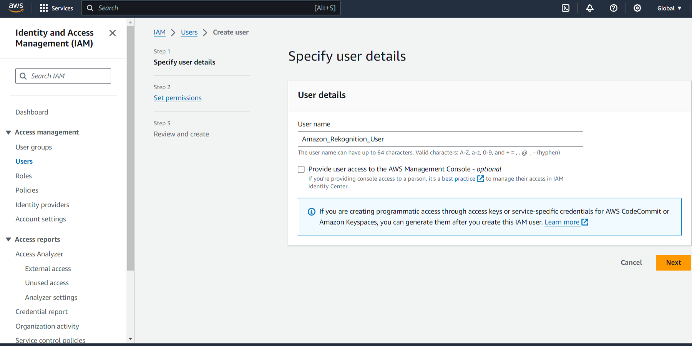
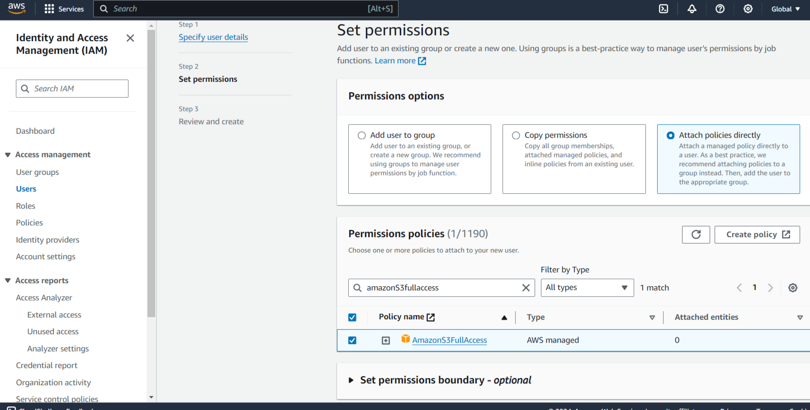
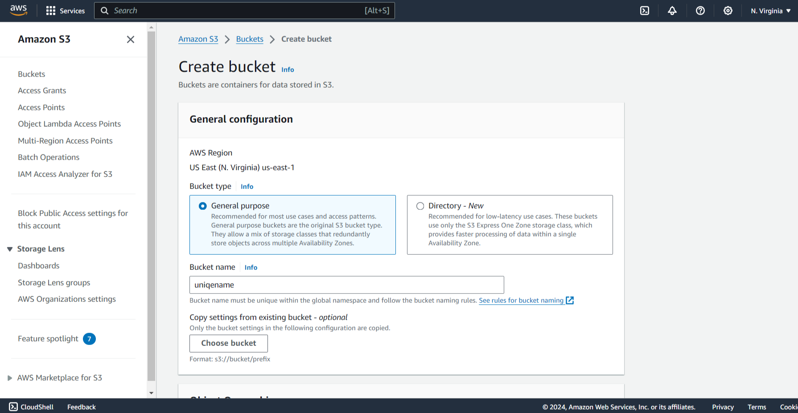
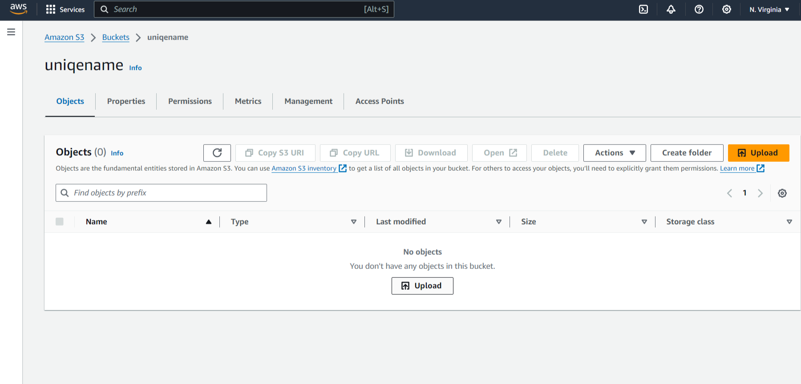

# AWS-Facial-Recognition-API-Application
app that demonstarates how to use Amazon Rekognition api features for facial recognition with node.js

## AWS Configurations
1. You need to log in to AWS service.
2. Configure user and storage and get permission to run Amazon Rekognition API:
-User:
    - Type "IAM" into the search bar, click the "users" in the left menu and then "add user".
    - 
    - Choose "programming use option" and add polices "amazonS3fullaccess" and "amazonrekognitionfullaccess".
    - 
    - Generate access key id and secret access key.
-Bucket:
    - Type "S3" into the search bar, click the "buckets" in the left menu and then "create bucket".
    - Type uniqe bucket name and same aws region as we will use in the project later.
    - 
    - Click create bucket
    - Upload images that you want to analyze into your bucket.
    - 
## Project Configuration
1. Clone this project "git clone https://github.com/coursera-guided/amazon-rekognition.git" and install dependensies:
    - type into project terminal "npm install" and "npm install aws-sdk".
    - paste your public and private keys into env file.
2. Run project.
    - Type node server.js into your terminal in ptoject directory to run application.
    - Go to localhost:8089 in yuor browser to test application.

## Clean up
1. Clean up your enviroment:
    - Delete bucket and user to avoid aws payment, aws is pay to use platform, so you need to clean all stuff after usage. 
